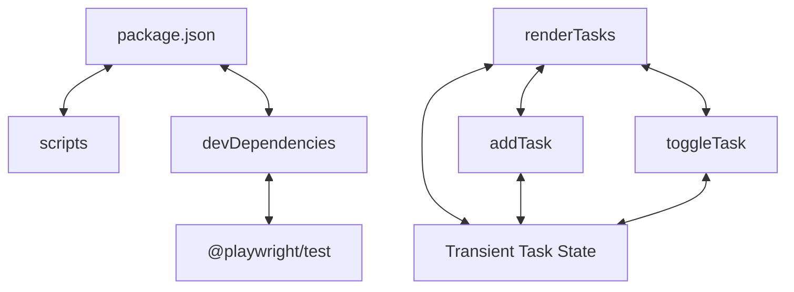

# Codebase Architectural Report

> **Auto-generated** by graphify knowledge graph analysis  
> **Purpose**: Dependency map, connection analysis, subsystem breakdown, and quality hotspots.

---

## 1. Executive Summary

- **Total Components**: `20`
- **Total Connections**: `16`
- **Subsystem Modules**: `1`
- **Dependency Types**: `4`

**Key Architectural Hubs:**

| # | Component | File | Type | Connections |
|---|-----------|------|------|-------------|
| 1 | `package.json` | `package.json` | function | 6 |
| 2 | `renderTasks` | `index.html` | function | 4 |
| 3 | `Transient Task State` | `index.html` | class | 4 |
| 4 | `scripts` | `package.json` | function | 2 |
| 5 | `devDependencies` | `package.json` | function | 2 |
| 6 | `@playwright/test` | `package.json` | function | 2 |
| 7 | `addTask` | `index.html` | function | 2 |
| 8 | `toggleTask` | `index.html` | function | 2 |

---

## 2. Dependency & Connection Analysis

### Relationship Types

| Relationship | Count | Share |
|-------------|-------|-------|
| `contains` | 8 | 50% |
| `shares_data_with` | 4 | 25% |
| `calls` | 3 | 19% |
| `imports` | 1 | 6% |

### Hub Dependency Diagram

### Most Connected Pairs

| Component A | Component B | Shared Connections |
|-------------|-------------|-------------------|
| `description` | `package.json` | 1 |
| `devDependencies` | `package.json` | 1 |
| `name` | `package.json` | 1 |
| `package.json` | `private` | 1 |
| `package.json` | `scripts` | 1 |
| `package.json` | `version` | 1 |
| `scripts` | `test:e2e` | 1 |
| `@playwright/test` | `devDependencies` | 1 |
| `@playwright/test` | `@playwright/test` | 1 |
| `addTask` | `renderTasks` | 1 |

---

## 3. Subsystem & Module Breakdown

### 3.1 package.json
**Nodes**: `20`  
**Files**: `.playwright-tmp/playwright-transform-cache-1000/72/playwrightconfig_72a850a9d725ee20e6caa7f029842671096b594e.js`, `.playwright-tmp/playwright-transform-cache-1000/b2/todoworkflowspec_b2b0584b69f9b965533cc3be84d6d4d072b5ab92.js`, `e2e/todo-workflow.spec.ts`, `index.html`, `package.json`, `playwright.config.ts` +1 more

| Component | Type | File | Connections |
|-----------|------|------|-------------|
| `package.json` | function | `package.json` | 6 |
| `renderTasks` | function | `index.html` | 4 |
| `Transient Task State` | class | `index.html` | 4 |
| `scripts` | function | `package.json` | 2 |
| `devDependencies` | function | `package.json` | 2 |
| `@playwright/test` | function | `package.json` | 2 |
| `addTask` | function | `index.html` | 2 |
| `toggleTask` | function | `index.html` | 2 |
| `deleteTask` | function | `index.html` | 2 |
| `name` | function | `package.json` | 1 |

---

## 4. API Reference

Public classes and functions by subsystem.

### package.json

| Name | Type | File | Connections |
|------|------|------|-------------|
| `package.json` | function | `package.json` | 6 |
| `renderTasks` | function | `index.html` | 4 |
| `Transient Task State` | class | `index.html` | 4 |
| `scripts` | function | `package.json` | 2 |
| `devDependencies` | function | `package.json` | 2 |
| `@playwright/test` | function | `package.json` | 2 |
| `addTask` | function | `index.html` | 2 |
| `toggleTask` | function | `index.html` | 2 |

---

## 5. Code Quality & Architectural Risk Hotspots

### Component Type Distribution

| Type | Count | Share |
|------|-------|-------|
| function | 15 | 75% |
| file | 4 | 20% |
| class | 1 | 5% |

### Dependency Cycles

**3** circular dependency loop(s) detected:

| # | Cycle Path |
|---|-----------|
| 1 | `index_rendertasks → index_toggletask → index_transient_task_state` |
| 2 | `index_addtask → index_rendertasks → index_transient_task_state` |
| 3 | `index_deletetask → index_rendertasks → index_transient_task_state` |

### Orphaned Components

**5** isolated node(s) with no connections:

| Component | File |
|-----------|------|
| `playwrightconfig_72a850a9d725ee20e6caa7f029842671096b594e.js` | `.playwright-tmp/playwright-transform-cache-1000/72/playwrightconfig_72a850a9d725ee20e6caa7f029842671096b594e.js` |
| `todoworkflowspec_b2b0584b69f9b965533cc3be84d6d4d072b5ab92.js` | `.playwright-tmp/playwright-transform-cache-1000/b2/todoworkflowspec_b2b0584b69f9b965533cc3be84d6d4d072b5ab92.js` |
| `todo-workflow.spec.ts` | `e2e/todo-workflow.spec.ts` |
| `playwright.config.ts` | `playwright.config.ts` |
| `todo-workflow` | `todos.yaml` |

---

## 6. How to Navigate

1. **Interactive D3 Map** — open `graph.html` to explore node connections visually.
2. **Knowledge Graph Queries** — use MCP tools (`graph_query`, `graph_explain_node`, `graph_impact_radius`).
